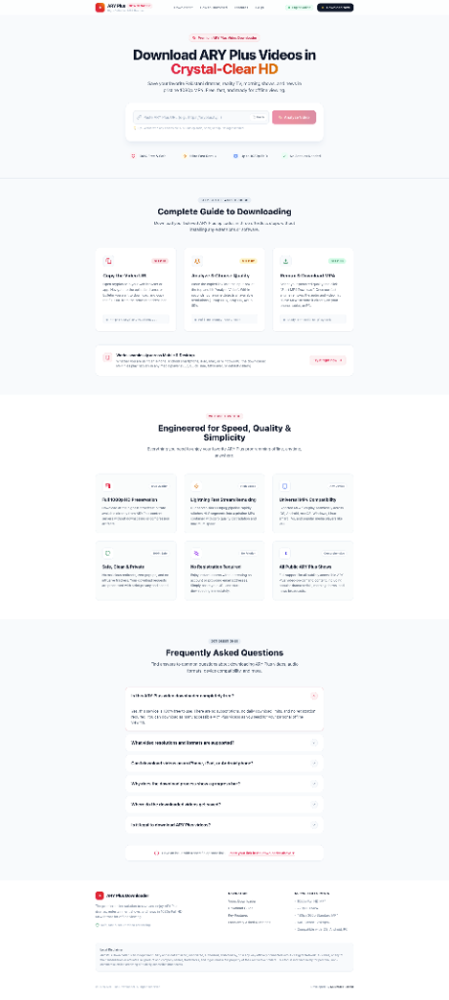
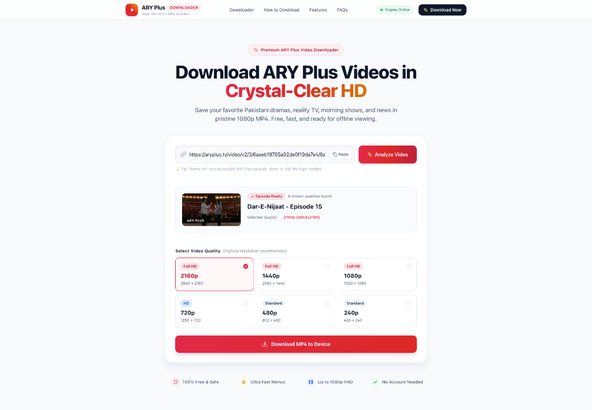
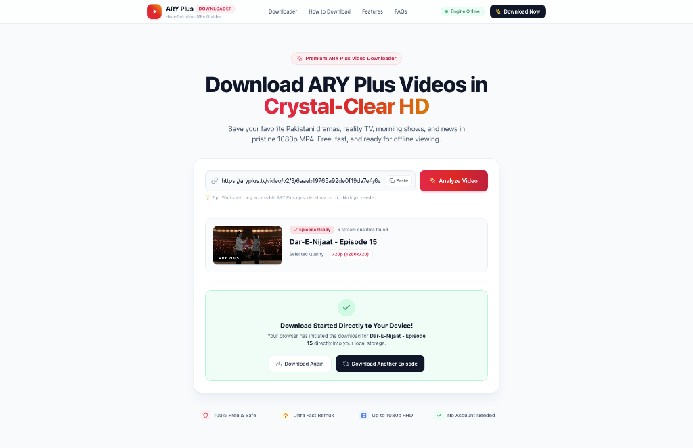

# ARY Plus Downloader

A modern, high-speed web platform for downloading accessible ARY Plus VOD episodes and dramas for offline personal viewing in pristine MP4 format.

[](https://aryplus-downloader.onrender.com/)
[](https://nextjs.org/)
[](https://www.typescriptlang.org/)
[](https://tailwindcss.com/)
[](https://ffmpeg.org/)
[](https://playwright.dev/)

---

## 🌐 Live Application

Try the platform live in your browser:  
👉 **[https://aryplus-downloader.onrender.com/](https://aryplus-downloader.onrender.com/)**

---

## 📸 Platform Showcase

### 1. Landing Page & Downloader Hero
Modern, elegant light theme featuring an intuitive URL input with clipboard paste support, numbered step-by-step guide, feature highlights, and interactive FAQs.



### 2. Video Analysis & Quality Selection
Automatically resolves unencrypted HLS master playlists and lists all available resolutions (1080p FHD, 720p HD, 480p, etc.) with real-time stream details.



### 3. 1-Step Direct-to-Device Download
Streams the remuxed MP4 directly to your device in a single step with zero server storage overhead, full video duration, and synchronized audio.



---

## ⚡ Key Features

- **1-Step Direct-to-Device Download**: Remuxes HLS streams on the fly directly into your browser's download folder—no waiting for server downloads or downloading twice.
- **Lossless Stream Remuxing**: Powered by FFmpeg stream copy (`-c copy` with `aac_adtstoasc` bitstream filtering) for ultra-fast, lossless conversion without re-encoding.
- **Quality Options**: Choose from all available stream qualities up to 1080p Full HD.
- **Automated Stream Resolution**: Headless Playwright engine intercepts dynamic HLS playlists directly from the ARY Plus React SPA.
- **Elegant Light UI**: Fully responsive, clean interface tailored for both desktop and mobile devices.
- **100% Free & No Account Needed**: No registration, subscriptions, or intrusive ads.

---

## 🏗️ Architecture & How It Works

1. **Resolver**: Uses headless Chromium via Playwright to dynamically intercept `.m3u8` master playlist requests generated by the ARY Plus frontend player.
2. **HLS Parser**: Parses the master playlist manifest to extract available video resolutions and bandwidth variants.
3. **Direct Streaming Pipeline**: Spawns an FFmpeg child process that reads the remote HLS stream and pipes fragmented MP4 (`frag_keyframe+empty_moov+default_base_moof`) directly into an HTTP `ReadableStream` response.
4. **Client-Disconnect Cancellation**: If the user cancels the download in the browser, the server automatically terminates the FFmpeg process to free resources.

---

## 📋 Requirements

- [Node.js](https://nodejs.org/) 20+
- [FFmpeg](https://ffmpeg.org/) (with `ffprobe`) installed and available in your system `PATH`

---

## 🚀 Getting Started

### 1. Clone the Repository
```bash
git clone https://github.com/mukhtarhussain1/aryplus-downloader.git
cd aryplus-downloader
```

### 2. Install Dependencies
```bash
npm install
```

### 3. Install Playwright Chromium Browser
```bash
npx playwright install chromium
```

### 4. Install FFmpeg
- **macOS** (Homebrew):
  ```bash
  brew install ffmpeg
  ```
- **Ubuntu / Debian**:
  ```bash
  sudo apt update && sudo apt install -y ffmpeg
  ```

### 5. Run the Application
```bash
# Start development server
npm run dev

# Or build and run production server
npm run build
npm start
```

Open [http://localhost:3000](http://localhost:3000) in your browser.

---

## 🔒 Security

- **Domain Allowlisting**: Validates target URLs and media hosts to protect against arbitrary Server-Side Request Forgery (SSRF).
- **Safe Command Execution**: Spawns subprocesses using structured argument arrays rather than shell string execution, preventing command injection.

---

## ⚖️ Disclaimer

This application is strictly for personal offline viewing of *publicly accessible* and *authorized* media streams. It does NOT bypass DRM, decrypt Widevine/PlayReady, or perform authentication-stealing. It operates solely on unencrypted HTTP Live Streaming (HLS) VOD content.

---

## 👨‍💻 Author

**Developed By Mukhtar Hussain**
